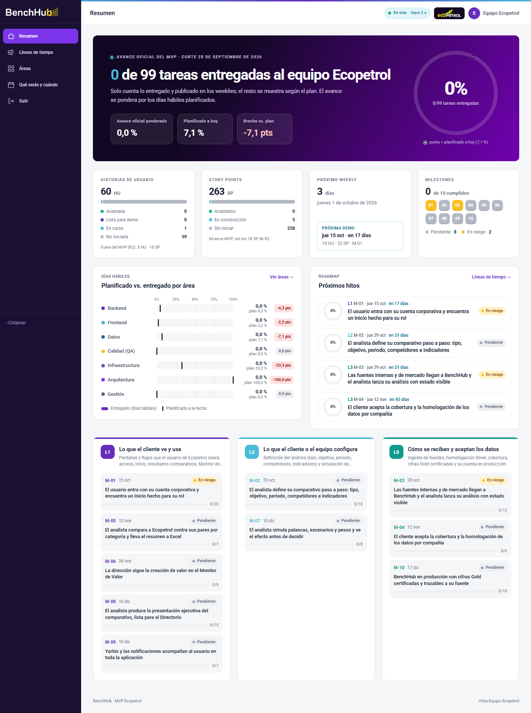

# Seguimiento BenchHub · MVP Ecopetrol

App web de seguimiento del proyecto BenchHub para el equipo Ecopetrol. Next.js 16 (App Router), Tailwind v4, Drizzle + SQLite (libsql).



## Acceso y roles

Login por PIN. Cada rol tiene su PIN en variables de entorno: `PIN_CLIENTE` (alias `PIN_ECOPETROL`) para el rol de consulta
**Equipo Ecopetrol**, `PIN_EDITOR` y `PIN_ADMIN` (valores de ejemplo para desarrollo en [`.env.example`](.env.example); cámbialos antes de desplegar).

| Rol | Qué puede hacer |
| --- | --- |
| Equipo Ecopetrol | Solo lectura (rol de consulta). Ve la capa oficial: únicamente lo aprobado y publicado, sin notas ni riesgos internos, sin evidencia técnica. Clic en un nodo = panel de lectura. **Todas** las rutas mutantes le responden 403. |
| Editor | Actualiza el estado técnico, la evidencia y las notas; alterna la visibilidad; **aprueba y publica** (o retira) tareas y milestones con fecha y nota de entrega. |
| Admin | Lo mismo que el editor (el reimport del Excel se hace por CLI). |

- La sesión es una cookie `httpOnly` con un token firmado HMAC-SHA256 (`SESSION_SECRET`, mínimo 32 caracteres), válida 12 horas. El PIN nunca viaja en la URL ni se registra.
- `src/proxy.ts` (antes `middleware.ts`, renombrado en Next 16) protege todo excepto el login y los estáticos; las rutas `/api/*` sin sesión responden 401.
## Puesta en marcha

```bash
cp .env.example .env.local          # PINs y secreto de ejemplo
pnpm install
pnpm run db:migrate                 # crea data/seguimiento.db (los imports también migran)

# 1. Plan (sprints, festivos, HU, tareas, predecesoras)
pnpm run import -- "../working_plan_BenchHub_v2 2 EQUIPO.xlsx"
# 2. Estados iniciales desde la matriz de evidencia (origen «código»)
pnpm run seed:evidence              # por defecto ../data/evidence/matriz_evidencia.csv
# 3. Milestones, líneas, vínculos HU/tarea, dependencias y riesgos
pnpm run import:milestones          # por defecto ../data/milestones_MANUEL.xlsx + seed/riesgos.csv
# 4. Calendario hábil, días por tarea, línea base por área y agenda de demos
pnpm run import:progress            # por defecto la carpeta ../data

pnpm build
pnpm start -p 3100                  # http://localhost:3100
```

Desarrollo: `pnpm dev` (puerto 3100). Para `next start` local en modo producción con los PIN de demo y la base `file:` hace falta
`LOCAL_DEMO=1` (la guardia de arranque lo exige; en Vercel se ignora).

**Despliegue (Vercel + libSQL/sqld en Fusion):** ver [`DEPLOY.md`](DEPLOY.md). `pnpm run db:bootstrap` prepara una base
remota desde cero de forma idempotente (migraciones, imports, estados técnicos, 0 publicaciones).

## Importación (no destructiva)

Todos los imports hacen UPSERT por id y solo actualizan columnas de plan. El estado gestionado en la app
(`estado`, `estado_origen`, `visible_cliente`, `fecha_estado`, `evidencia`, `fecha_cierre`, `interno` de riesgos),
las notas y la bitácora nunca se sobrescriben. Las relaciones nunca se borran; los ids que existen en la base y
faltan en el archivo se reportan como conflictos. Los Excel originales solo se leen en memoria.

- `import:milestones` lee `Tabla_Lineas`, `Tabla_Milestones` (valor para Ecopetrol, criterio, sprints, dependencias, riesgos),
  `Tabla_Milestone_HU`, `Tabla_Milestone_Tarea` y valida `Tabla_Areas` contra las 7 áreas de la app (no crea ids nuevos).
- `seed/riesgos.csv` versiona el catálogo de riesgos: R-01..R-04 de `Tabla_Riesgos` del working plan (visibles) y R-N1..R-N4
  de la consolidación (`docs/02_PROPUESTA_MILESTONES_MANUEL.md`), marcados **internos** por defecto.
- `import:progress` carga `progress/calendario_habil.csv`, `progress/tareas_dias.csv`, `progress/avance_area.csv` y
  `agenda/agenda_*.csv`. La app no lee CSV en runtime.

### Verificación

```bash
pnpm run verify:import -- "../working_plan_BenchHub_v2 2 EQUIPO.xlsx"   # conteos + T-010 sobrevive al re-import
pnpm run verify:milestones   # 10 milestones, 3 líneas, 60 HU; re-import sin inserciones; 7,07 % plan vs 24,79 % real
pnpm run check:edit          # E2E (servidor propio en :3101 sobre la copia): edición, publicar/retirar, polling, notas internas, 403
pnpm run check:capas         # Equipo Ecopetrol: 0/99 inicial y sin rastros técnicos (HTML + RSC); admin ve ambas capas; capturas
pnpm run check:readonly      # enumera TODAS las rutas mutantes y server actions: 403 para el rol de consulta; UI sin controles
pnpm run check:copy          # HTML + RSC de cada página y rol: 0 veces la palabra prohibida (salvo nombres del plan, listados)
pnpm run check:timeline      # E2E del panel de entregables de /lineas como Equipo Ecopetrol (clic, Esc, ?m=, sin riesgos internos)
pnpm run screens             # capturas en docs/screens/
```

## Paleta y aspecto (arquetipo BenchHub)

La paleta, la tipografía (Roboto / Roboto Mono vía fontsource) y el aspecto replican `eco-comparator-web`:
`src/app/theme.css` es una copia literal de su `src/app/styles/theme.css` (tokens `--color-*`, `--gradient-*`, `--shadow-*`, `--text-*`),
el login replica SCR-01 (foto de refinería bajo `--gradient-login-overlay`, tarjeta de vidrio, CTA `--gradient-login-cta`) y el
shell replica `widgets/app-shell` (sidebar oscuro con `brand-nav-active`, cabecera blanca con `--gradient-header-strip`).
`pnpm run check:palette` falla si en `src/**` aparece un hex, `rgb()` o `hsl()` que no sea un valor del set de tokens.
Comparación: `docs/screens/palette-login-compare.png`.

## Dos capas de avance

- **Oficial (Equipo Ecopetrol):** una tarea o un milestone solo cuenta como entregado si un editor o administrador lo **aprueba y publica**
  (`publicado_cliente`: fecha en que se completó y nota de entrega, p. ej. «Demostrado en weekly 15/10»). **Nada empieza publicado:**
  el avance oficial arranca en 0/99. El resto se muestra según el plan: Pendiente antes de su inicio, En curso después.
  El Equipo Ecopetrol nunca ve estados técnicos, rutas de repositorio, commits ni evidencia de código.
- **Técnica interna (editor/admin):** estado respaldado por código (matriz de evidencia + editor), rotulado
  «Avance técnico interno (local, no visible para el equipo Ecopetrol)» junto a los números oficiales. Es solo **evidencia técnica sugerida**:
  nunca fija el estado oficial.
- «Aprobar y publicar» / «Retirar publicación» (editor o admin) en el panel del editor, en la cola «Pendiente de verificación» (`/verificacion`),
  en la ficha de la tarea y, para milestones, en el panel de la línea de tiempo. La tarea debe estar Hecha; la fecha no puede ser futura.
  Todo queda en la bitácora con rol y fecha; el Equipo Ecopetrol lo ve en segundos. El re-import nunca toca estas columnas.
- `pnpm run db:sin-publicaciones` retira (con registro «configuración inicial: sin publicaciones») lo que haya publicado el antiguo seed automático.

## Pruebas sin tocar la base viva

`verify:*` y `check:*` trabajan sobre `data/seguimiento.test.db`, una copia fresca de `data/seguimiento.db` en cada ejecución;
los `check:*` levantan su propio `next start` en :3101 sobre esa copia. `pnpm run db:clean-test-artifacts` limpia restos de
pruebas anteriores al aislamiento (idempotente, imprime lo que cambia).

## Reglas de negocio

- **Avance por código** de un milestone o área = tareas `Hecha` / tareas; **ponderado** = días hábiles hechos / días hábiles.
- **Planificado a la fecha** = tareas cuya fecha fin ya pasó / tareas (misma regla que `avance_area.csv`).
- **Avance por SP** = SP de HU aceptadas (o «Lista para demo», según el ajuste) / SP totales.
- **Estado sugerido** del milestone: Cumplido si todas sus HU cuentan como completas; Atrasado si la fecha pasó; En riesgo si
  una tarea en ruta crítica venció sin cerrarse; En curso si hay avance; si no, Pendiente. El editor puede fijarlo a mano
  o volver a «Automático».
- Marcar una tarea como **Hecha** (o una HU como **Aceptada**) exige evidencia; sin ella el endpoint responde 422.
- Cada cambio escribe en la **bitácora**: rol, fecha, campo y valor anterior → nuevo.
- La vista Equipo Ecopetrol consulta `/api/version` cada 8 s y se refresca sola cuando hay cambios.
- «Hoy» es la fecha de Bogotá; para demos se puede fijar con `APP_HOY=yyyy-mm-dd`.

## Vistas

| Ruta | Contenido |
| --- | --- |
| `/` | Resumen: KPIs, anillo de avance, planificado vs. real por área, próximos hitos, milestones por línea |
| `/lineas` | Roadmap de L1/L2/L3 (sprints, festivos, «hoy», nodos por estado) con filtro por área. Clic en un nodo abre sus entregables en la misma vista (bajo la línea; bottom sheet en móvil); `?m=M-01` lo abre al cargar; Esc, X o un nuevo clic lo cierran |
| `/milestones/[id]` | Valor, criterio, pestañas por área y por HU, dependencias, riesgos, notas |
| `/areas` | Resumen por área y detalle filtrado |
| `/historias/[id]`, `/tareas/[id]` | Detalle de HU y de tarea |
| `/agenda` | Qué verás y cuándo: demos por weekly |
| `/editor`, `/bitacora` | Panel del editor y bitácora (solo editor/admin) |

Capturas: `docs/screens/` (dashboard-ecopetrol, dashboard-admin, admin-verificacion, timeline, timeline-m01, milestone, area, agenda, editor, log, login, palette-login-compare).

## Endpoints de edición (solo editor/admin)

`POST /api/editor/estado`, `/api/editor/nota`, `/api/editor/visibilidad`, `/api/editor/config`, `/api/editor/publicacion` (JSON), solo editor/admin.
Roles de consulta → 403 en todas (`check:readonly` las enumera), sin sesión → 401.